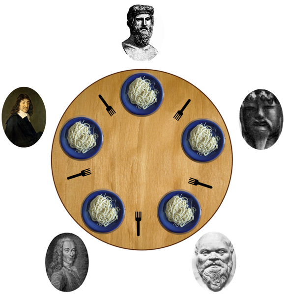
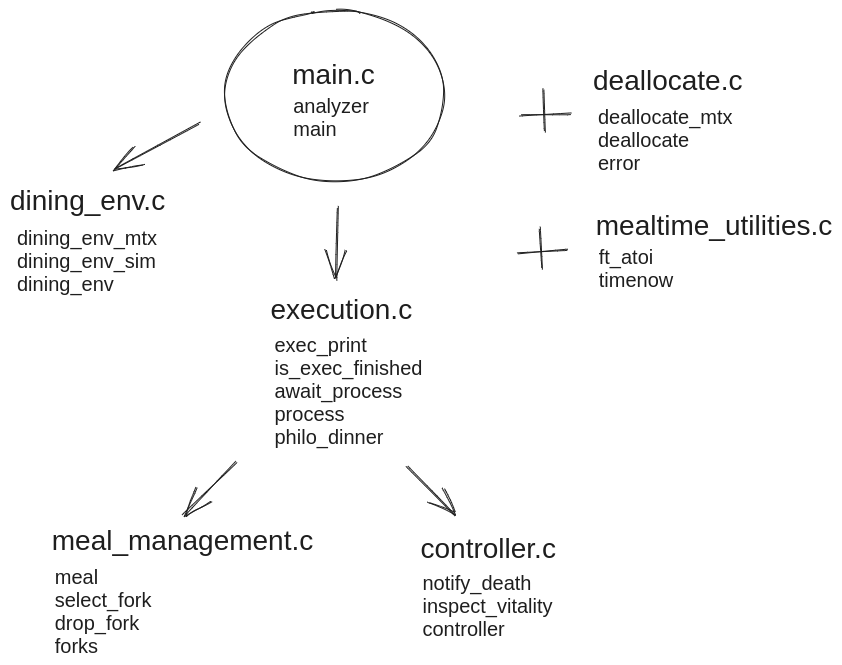
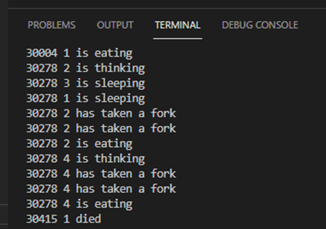

## 42-philosophers

O problema do jantar dos filósofos é um problema clássico, originalmente formulado por E.W. Dijkstra, para demonstrar problemas em ciência da computação e a programação de processos concorrentes ou paralelos.



Vários filósofos estão sentados em torno de uma mesa redonda com uma grande tigela de espaguete no centro. Eles alternam entre comer, pensar e dormir. Enquanto estão comendo, não estão pensando nem dormindo; enquanto estão pensando, não estão comendo nem dormindo; e, enquanto estão dormindo, não estão comendo nem pensando. Cada filósofo tem um garfo à sua disposição para comer, um na mão direita e outro na mão esquerda. Quando terminam de comer, colocam os garfos de volta na mesa e começam a dormir. Ao acordarem, retomam o processo de pensamento. A simulação termina quando um filósofo morre de fome. É essencial que todos os filósofos se alimentem adequadamente e evitem morrer. Eles não se comunicam entre si e não têm conhecimento da iminência da morte de outro filósofo. O objetivo é garantir que todos os filósofos sejam alimentados e que a morte seja evitada.

## Fluxograma das funções

## Como compilar e executar o projeto

#### 1) Copie esse repositório para sua máquina

```html
git clone git@github.com:prezadopedro/42-philosophers.git
```

#### 2) Escolha a pasta principal para compilar o projeto

```html
cd philo/ && make
```


#### 3) Execute o programa

O programa recebe pelo menos 5 argumentos. O primeiro parâmetro é o arquivo binário do programa e o último é opcional. A representação de cada um deles:

| #2 | #3 | #4 | #5 | #6 (opcional) |
|:----|:----|:----|:----|:----|
| 4 | 800 | 300 | 300 | 6 |
| `number_of_philosophers` | `time_to_die` | `time_to_eat` | `time_to_sleep` | `number_of_times_each_must_eat` |

#### 5) Na linha de comando:

```html
./philo 4 800 300 300 6
```
#### 6) Será printado:
| `timestamp_in_ms` | `number of philosopher` | `action` | 

